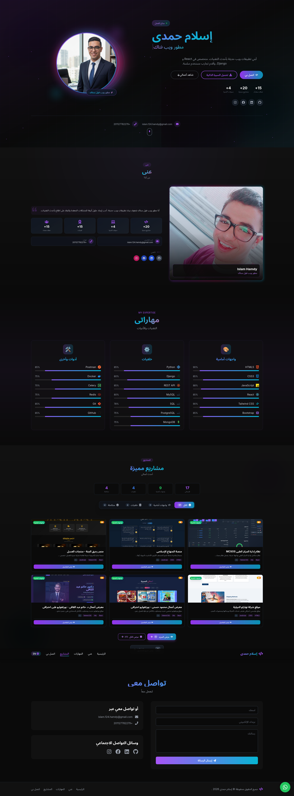
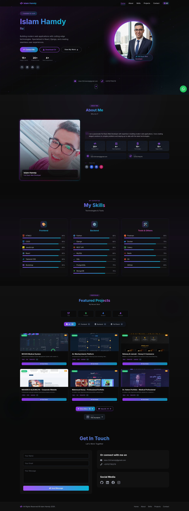

# Islam Hamdy — Web Developer Portfolio (ENG-Islam-Portfolio)

Welcome to my web developer portfolio!  
This project is a modern, responsive personal website built to showcase my work, skills, and contact information in a clean and professional layout.  

## 🚀 Live Server
You can view the live website here:  
- **Live Server:** `https://islam-portfolio-phi.vercel.app/`

## 🧩 Project Overview
This portfolio is built using a fast React + Vite setup with a clean UI styled using Tailwind CSS.  
It includes a responsive design and sections suitable for a developer portfolio (such as introduction, skills, projects, and contact area).  

*(When you add screenshots, you can include them in the “Screenshots” section below.)*

## 🛠️ Tech Stack
- **React** (UI / components)
- **Vite** (development & build tool)
- **Tailwind CSS** (styling)
- **JavaScript** (main logic)
- **ESLint** (code quality)

## 📌 How to Run Locally
1. Clone the repository:
   ```bash

    - git clone https://github.com/Islam412/ENG-Islam-Portfolio.git

2. Go to project folder:
    ```bash

    - cd ENG-Islam-Portfolio

3. Install dependencies:
    ```bash

    - npm install

4. Start the development server:
    ```bash

    - npm run dev

5. Open in your browser (usually):
    text
    ```bash

    - http://localhost:5173/

## 📸 Screenshots

### AR Demo
- 

### EN Demo
- 

## 📬 Contact

  - If you’d like to work together, feel free to reach out via the contact section on the website or through my GitHub profile.